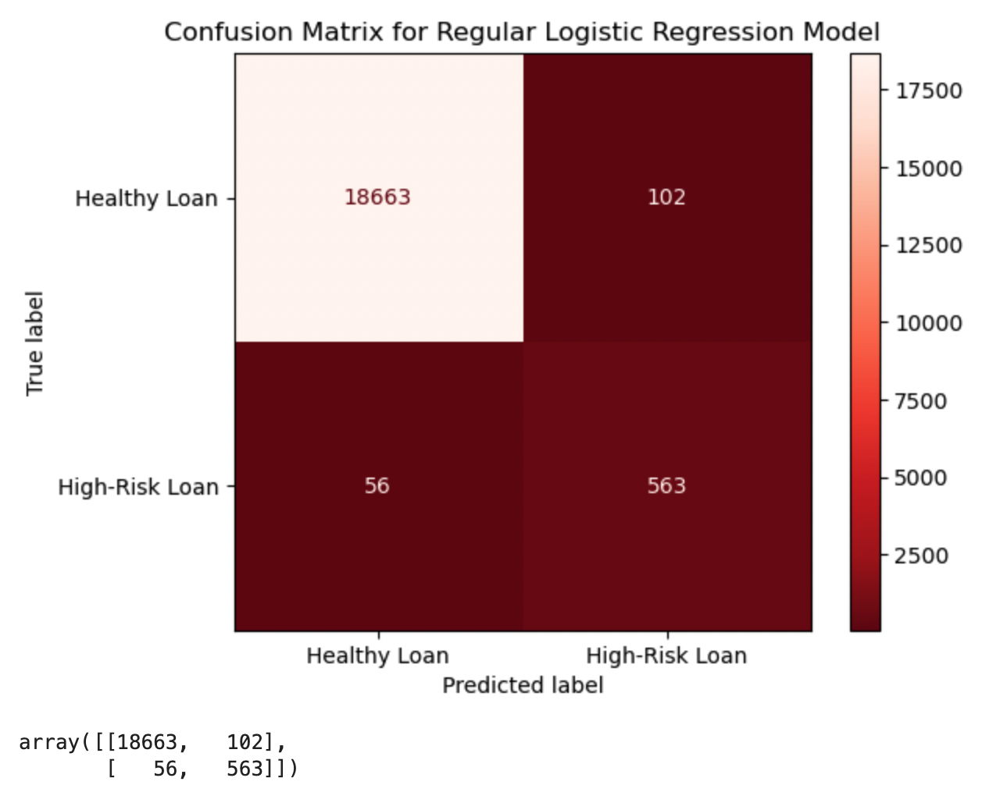
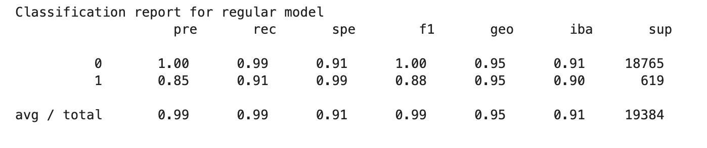
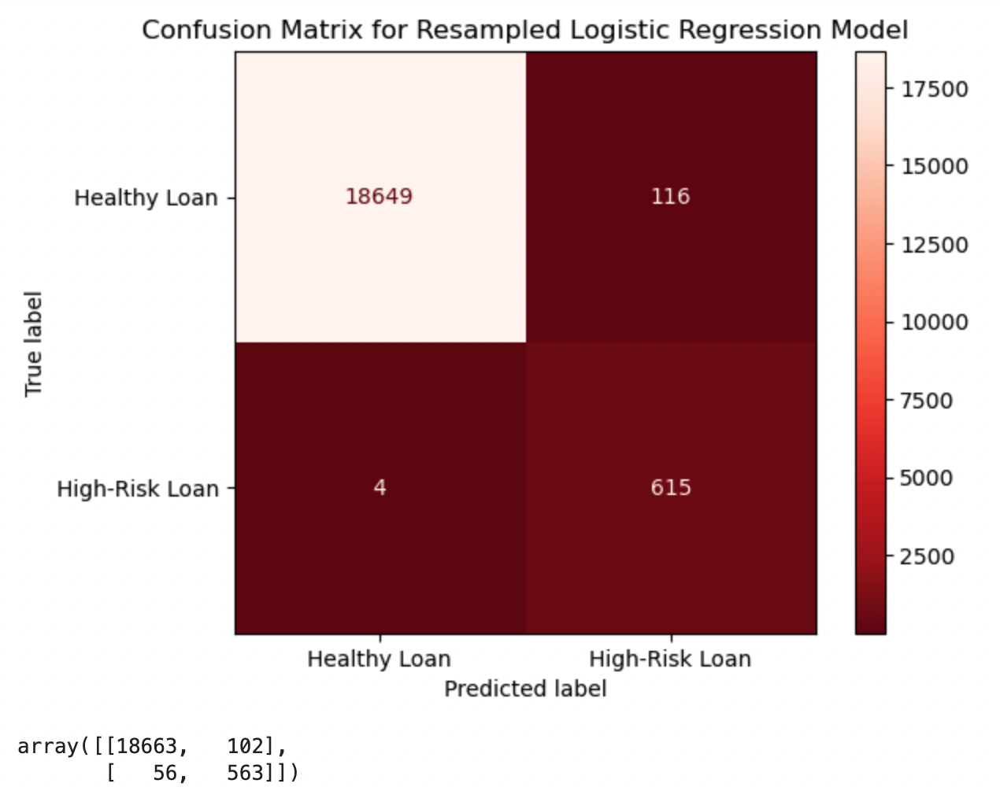
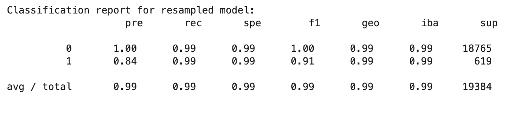

# Logistic Regression Models Report

## Overview of the Analysis

In this report, we will analyze the performance of two logistic regression models for predicting loan status in a financial dataset. The purpose of this analysis is to determine which model is better equipped to accurately predict the loan status of an individual based on the information provided.

The dataset consists of various financial attributes of individuals who have taken out loans. Our goal is to predict the loan status of these individuals, either as a "Healthy Loan" (0) or a "High-Risk Loan" (1).

## Model Process
To accomplish this goal, we went through several stages in the machine learning process. The first step was to split the data into training and testing sets. We then used the training data to train two logistic regression models. The first model was trained on the original, imbalanced data, while the second model was trained on resampled data using the `RandomOverSampler` method from the imbalanced-learn library.

## Results
Here are the performance metrics for each of the two models:

* Regular Model:

- The balanced accuracy score for this model is 0.99.
- The precision score for the "Healthy Loan" label is 1.00, while the precision score for the "High-Risk Loan" label is 0.85.
- The recall score for the "Healthy Loan" label is 0.99, while the recall score for the "High-Risk Loan" label is 0.91.

* Resampled Model:

- The balanced accuracy score for this model is 0.99.
- The precision score for the "Healthy Loan" label is 1.00, while the precision score for the "High-Risk Loan" label is 0.84.
- The recall score for the "Healthy Loan" label is 0.99, while the recall score for the "High-Risk Loan" label is 0.99.

## Conclusion
Both models performed well in predicting the healthy loans and high-risk loans, with similar balanced accuracy scores of 0.99. The oversampled model had a higher recall score for class 1 (high-risk loan), but a lower precision score compared to the regular model. Ultimately, the choice between the two models will depend on the importance placed on precision or recall for the high-risk loans. If a higher recall is desired, the oversampled model would be recommended. If a higher precision is desired, the regular model would be recommended.